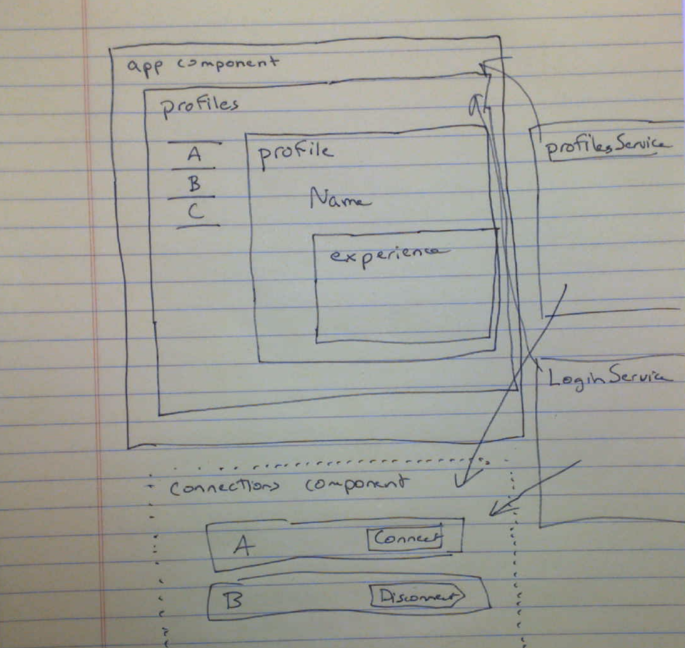

# Routing

## routing

1. adding routing to your angular application
   - creating routes `{ path: '', component: Component}`
   - why `a href` won't work
1. routerLink
   - string
   - array - `['/users', 15]`
1. routerLinkActive
1. routerLinkActiveOptions `{exact: true}`
1. Injecting the router
1. ActivatedRoute (navigate, relativeTo)
1. Parameterized Routes `path: 'users/:id'`
   - loading parameter from `ActivatedRoute` - `this.route.snapshot.params['id']` (in ngOnInit)
1. What about reactive components?
   - `this.route.params` - an `Observable`
   - `this.route.params.subscribe((params: Params) => { this.user.id = params['id'] })`
   - angular is reaping the subscriptions
   - could use onDestroy
1. more params
   - `[queryParams]="{ user: 1 }"`
   - `fragment=loading`
   - accsessing -- import `route: ActivatedRoute`
   - `this.route.snapshot.queryParams` - `this.route.queryParams`
   - `this.route.snapshot.fragment` - `this.route.fragment`
   - types - converting to a number with `+`
   - `queryParamsHandling` - merge, preserve, overwrite
1. Nested Routes - `children`
   - `router-outlet`
1. Guards
   - `ng generate guard auth`
   - `canActivate`
   - `canActivateChild`
1. Data
   - passing static data to a route

## Exercise - Guard your Routes

1. Add a redirect (using the Angular Router, no plain-javascript tricks allowed) so that when people go to your application without any url it redirects them to the `/connections` page.
2. Add a 404 route and Component to display a helpful message to your users when they mis-type a URL
3. Add a [Guard](https://angular.io/guide/router#preventing-unauthorized-access) that only allows you into the `/profiles` and `/connections` routes (and their children) if you're logged in.
   - will require a few more routes and components for login/logout

## Modules

1. How to split up your application
2. Loading Modules with Routes
3. Packing the chunks? - `ng build --optimize` then you can run a mini webserver (in the `dist/resume-david` directory with `python -m http.server`

## Resources

1. [Lazy-Loading Angular Components and Code through Modules](https://angular.io/guide/lazy-loading-ngmodules)
1. [One-liners to launch a static webserver](https://gist.github.com/henriquemenezes/cb8528078d1229ed7837)
1. [Angular Router](https://angular.io/guide/router)

## Architecture Diagram

